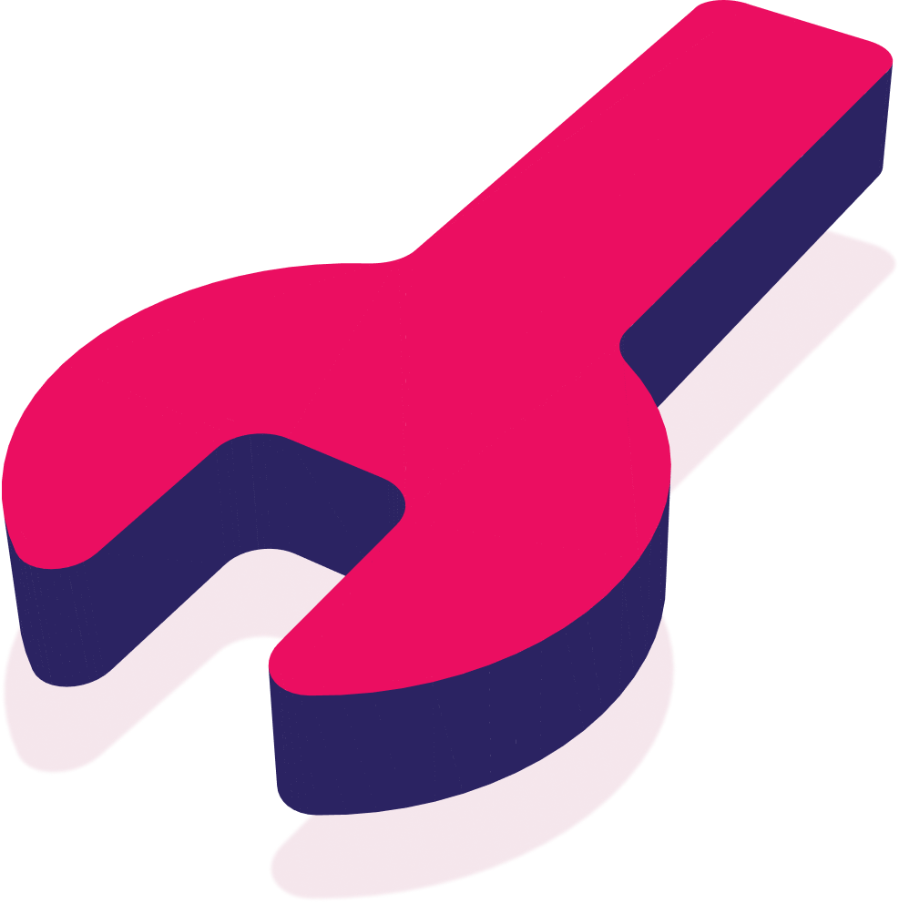

<!-- PROJECT SHIELDS -->
<!--
*** I'm using markdown "reference style" links for readability.
*** Reference links are enclosed in brackets [ ] instead of parentheses ( ).
*** See the bottom of this document for the declaration of the reference variables
*** for contributors-url, forks-url, etc. This is an optional, concise syntax you may use.
*** https://www.markdownguide.org/basic-syntax/#reference-style-links
-->

<!-- PROJECT LOGO -->
 

  

<h3 align="center">EduMotive</h3>

<!-- TABLE OF CONTENTS -->

  
Table of Contents

  <ol>
    <li>
      <a href="#about-the-project">About The Project</a>
      <ul>
        <li><a href="#built-with">Built With</a></li>
      </ul>
    </li>
    <li>
      <a href="#getting-started">Getting Started</a>
      <ul>
        <li><a href="#prerequisites">Prerequisites</a></li>
        <li><a href="#installation">Installation</a></li>
      </ul>
    </li>
    <li><a href="#usage">Usage</a></li>
    <li><a href="#license">License</a></li>
    <li><a href="#contact">Contact</a></li>
  </ol>

<!-- ABOUT THE PROJECT -->
## About The Project

[![Product Name Screen Shot][product-screenshot]](https://github.com/DannyPX/edumotive)

The idea of this project is to create an application that helps automotive students learn their profession in an innovative way that could help them learn from home as well instead of only at the workshop(s) on campus.The way we want to innovate the learning experience is by using tools like augmented reality so we can visualise what should be learnt and broaden the view a student would get from just a textbook.

(<a href="#top">back to top</a>)

### Built With

* [Kotlin](https://kotlinlang.org/)
* [Android Jetpack](https://developer.android.com/jetpack)

(<a href="#top">back to top</a>)

<!-- GETTING STARTED -->
## Getting Started

To get a local copy up and running follow these simple example steps.

### Prerequisites

* ARCore supported device
  See all supported devices [here](https://developers.google.com/ar/devices)

### Installation

1. Connect your device using an USB cable or Wireless debugging
2. When using an USB cable, enable USB debugging in Developer options on your device
3. Run the application

You can also download the APK from the [Releases](https://github.com/DannyPX/edumotive/releases)

(<a href="#top">back to top</a>)

<!-- USAGE EXAMPLES -->
## Usage

TODO

(<a href="#top">back to top</a>)

<!-- LICENSE -->
## License

Distributed under the MIT License. See `LICENSE.txt` for more information.

(<a href="#top">back to top</a>)

<!-- CONTACT -->
## Contact

Project Link: [https://github.com/github_username/repo_name](https://github.com/DannyPX/edumotive)

(<a href="#top">back to top</a>)

<!-- MARKDOWN LINKS & IMAGES -->
<!-- https://www.markdownguide.org/basic-syntax/#reference-style-links -->
[product-screenshot]: images/screenshot.png
